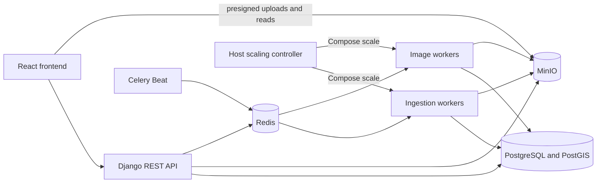

# Architecture

## Running components

Compose runs one Django/Gunicorn service, a React/Vite build served by Nginx, PostgreSQL with PostGIS, Redis with append-only persistence, MinIO, one Celery Beat service, and separate `ingest` and `images` worker services. The host launcher starts Compose and polls worker and queue status. The application containers do not receive the Docker socket.

## Data and API

`Dataset` belongs to one user. `UploadAsset` records an upload path, object key, expected size, and confirmation state. `Image` stores the source key, derived image keys, EXIF details, and an optional PostGIS point. `Job` stores ingestion and per-image task state; ingestion jobs are parent upload sessions. `StoredObjectDeletion` is an outbox for object removals committed with database changes. `LocalScalingPolicy` and `LocalScalingStatus` store the shared local worker settings and latest controller heartbeat.

Django uses session authentication and CSRF protection for browser writes. Dataset, image, and job API queries are scoped to the authenticated owner. MinIO objects are private; Django returns presigned upload instructions and short-lived signed read URLs. The health endpoint checks database connectivity.

The API exposes registration and login; dataset creation, listing, deletion, image listing, and map points; upload preparation and confirmation; upload-session processing, retry, cancellation, and deletion; image detail and deletion; and local scaling settings when the launcher enables them. Dataset and ordinary job lists use 50-item pages by default. The map endpoint returns all located points for the selected dataset in one response.

## Upload and processing flow

1. The browser sends file names and sizes to `uploads/prepare/`. Django validates paths, extensions, and the dataset's uploaded-item and uploaded-byte quotas, then creates `UploadAsset` rows and presigned MinIO upload instructions.
2. The browser transfers bytes directly to MinIO. Files up to 5,000,000,000 bytes use presigned POST; larger files use S3 multipart upload. On confirmation, Django completes multipart transfers when needed and checks the stored object size against the declared size.
3. `process/` creates a parent ingestion job for selected confirmed assets. The `ingest` worker validates source objects. For ZIPs it checks member paths, duplicates, symbolic links, encryption, entry counts, expanded size, and readable content before importing supported image entries. ZIP data is staged in temporary files, not extracted using member paths.
4. Ingestion creates image rows and metadata and preview child jobs. The `images` workers download each original, read dimensions, capture time, camera make/model, and EXIF GPS, and generate 320-pixel thumbnails and 1,600-pixel previews as WebP. GeoTIFF files use the TIFF decoding path; location is read from EXIF GPS.
5. PostgreSQL job rows track progress. A parent session completes after its latest metadata and preview tasks reach terminal states. Failures are recorded per image or upload asset. Celery Beat runs a reconciler every minute to republish old queued jobs and requeue running jobs whose database update time is more than 30 minutes old.

The default quota is 1,000 uploaded items and 10 GiB of uploaded bytes per dataset. ZIP entry count and expanded size are bounded per ingestion session. The image decoder rejects dimensions above 100 million pixels. The browser can retry failed uploads during the open dialog. Per-image task retries create new job rows.

Session cancellation locks the parent before its children, marks active rows cancelled in PostgreSQL, then asks Celery to revoke their tasks. Image workers save results only while their job and parent session remain active; abandoned preview objects are queued for cleanup under job-specific keys. Revoking work already executing is best effort. Deletion records object keys in the outbox in the same transaction as row removal. Celery retries cleanup failures, and Beat checks pending outbox rows every minute.

## Local worker scaling

`python3 scripts/local_autoscale.py` enables the scaling API, starts Compose, and checks both queues every 15 seconds. An untouched default policy fills the configured task-slot budget, up to four containers and four processes per queue. The launcher adds one container after 30 seconds of sustained broker backlog or worker saturation, including tasks held in Celery's reserved prefetch buffer. It removes one after at least 60 seconds of idle work and a 120-second cooldown. Scale-down requires empty broker, active, reserved, and scheduled work; failed inspection pauses changes. Celery adjusts process counts within each container, and the launcher applies saved process limits through Celery remote control.

Any signed-in user can update the machine-wide policy. Each queue permits one to four processes and one to four containers. The combined configured maximum must fit `LOCAL_SCALING_SLOT_BUDGET` (default eight slots). The switch on the Worker scaling page pauses container replica changes. The controller heartbeat is shown as offline when it is more than 45 seconds old.

## Current operating scope

Compose binds the frontend, API, and MinIO ports to loopback and uses local default credentials unless changed. The implementation has one database, one broker, one object store, and one scheduler. Queue scheduling is shared among users. The API paginates dataset, image, and job lists; the frontend follows dataset pages for the sidebar, filters unlocated images on the server before pagination, and follows all child-job pages for expanded upload sessions. The map endpoint returns all points for a dataset at once.
